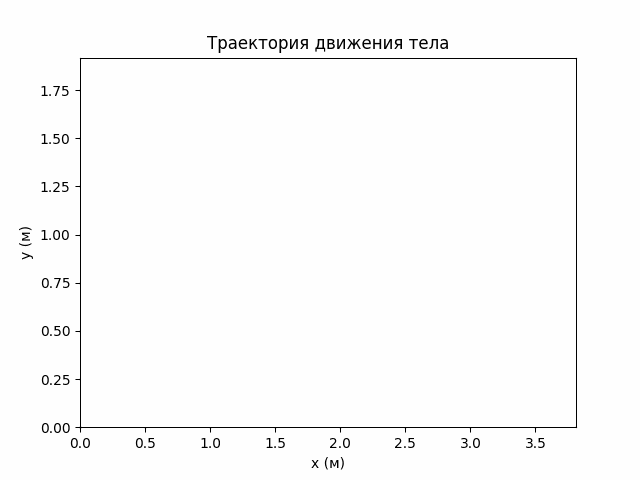
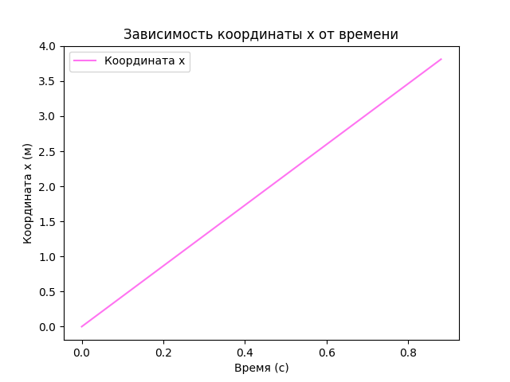
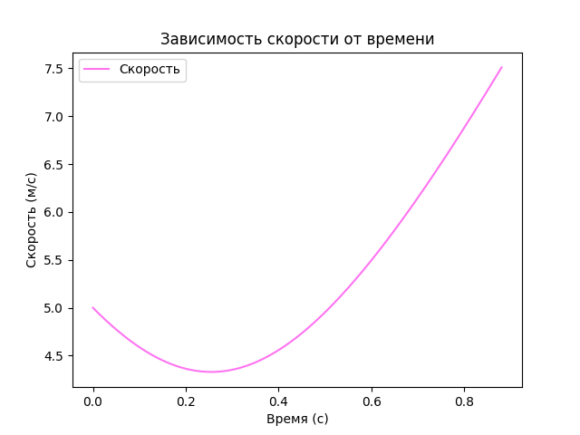

# Задание к лекции №2

>Написать программу, в виде исполняемого файла, визуализирующую баллистическое движение тела (брошенного под углом к горизонту). Сопротивлением пренебречь.
>+ **Входные данные:** высота, с которой брошено тело; начальная скорость; угол, под которым брошено тело. 
>+ **Результат:** визуализация траектории движение тела, графики зависимости скорости и координаты от времени.
## Теория
 
***Баллистическое движение*** — это движение некоторого тела в поле тяжести Земли при условии, что тело имеет вертикальную и горизонтальную проекции скорости.

Если не учитывать сопротивление воздуха, то такое движение представляет собой свободное падение.

Проекции начальной скорости на оси координат:
$$v_{0x} = v_0 cos\alpha$$
$$v_{0y} = v_0 sin\alpha$$

Движение тела, брошенного под углом к горзонту, можно рассматривать, как совокупность двух движений:
+ *Равномерное по оси x:* $$x = v_0tcos\alpha$$ $$v_x = v_0cos\alpha$$
+ *Равноускоренное по оси y:* $$0 = v_0sin\alpha - gt_{под}$$ $$t_{под} = (v_0sin\alpha)/g$$

 Максимальная высота подъема - координата y при времени подъема $t_{\text{под}}$
$$ h_{max} = v_0t_{под}sin\alpha - (gt^2_{под})/2 = (v_0sin^2\alpha)/2g$$

Примеры результатов работы программы:

### Источники теоретических материалов:
+ [Физика-light](https://light-fizika.ru/index.php/10-klass?layout=edit&id=84)
+ [Ассоциация победителей олимпиад](https://xn--80a2ac.xn--p1ai/%D0%BC%D0%B0%D1%82%D0%B5%D1%80%D0%B8%D0%B0%D0%BB%D1%8B/%D0%B1%D0%B0%D0%BB%D0%BB%D0%B8%D1%81%D1%82%D0%B8%D1%87%D0%B5%D1%81%D0%BA%D0%BE%D0%B5-%D0%B4%D0%B2%D0%B8%D0%B6%D0%B5%D0%BD%D0%B8%D0%B5-2/)